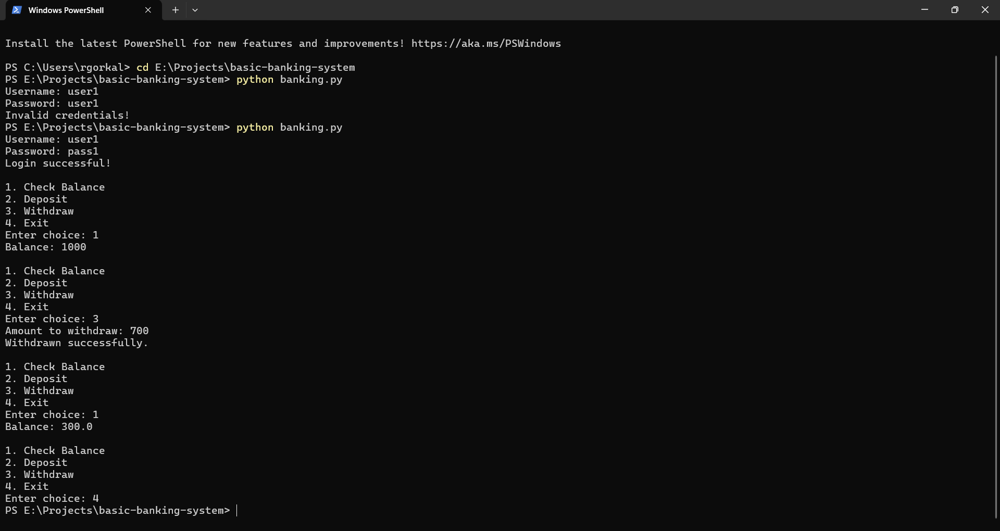

# Basic Banking System 

A simple command-line banking system built using Python. It allows a user to:
- Login
- Check account balance
- Deposit money
- Withdraw money

## Features
- Secure user login (basic simulation)
- Input validation
- Balance updates in memory (no database required)

## How to Run
1. Open a terminal (Command Prompt or Git Bash)
2. Go to the project folder
3. Run using:
```bash
python banking.py



